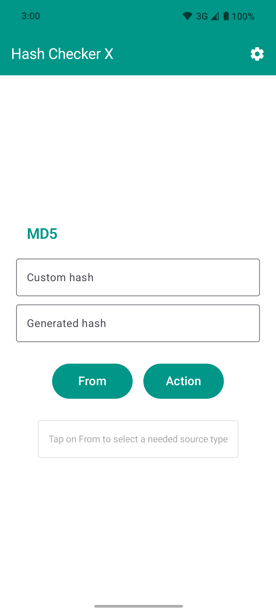
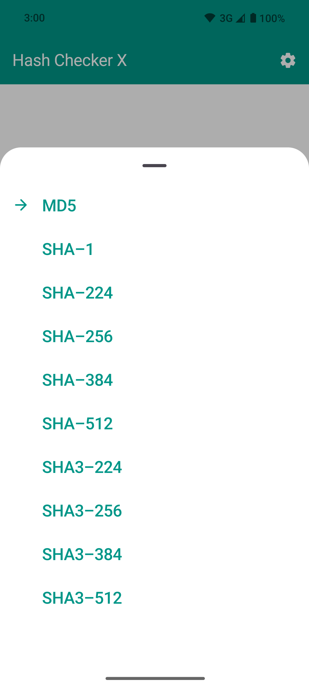
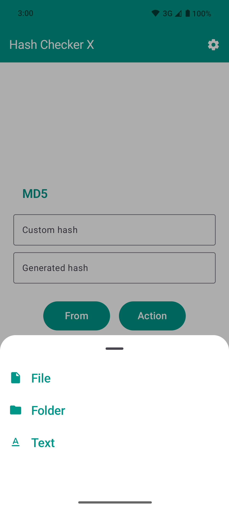
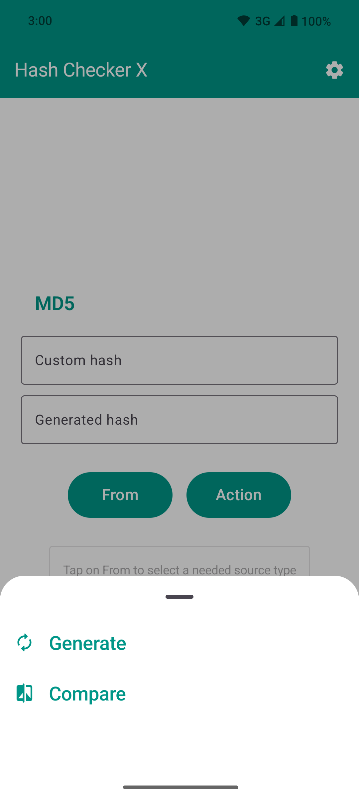
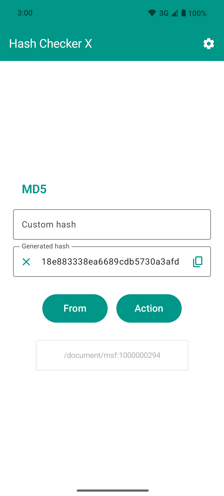
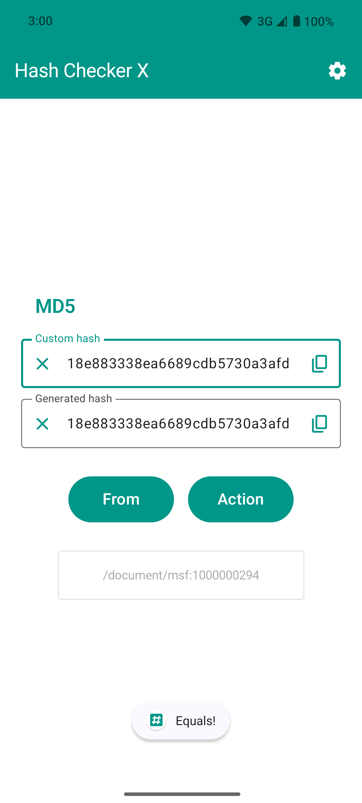

# NOTICE

At the moment, the application provides a minimum set of basic functions that were in the original project. But, given
that I am experimenting with a modern stack of Android applications, some components may not work quite optimally.

For more information see [Roadmap](#Roadmap).


# Hash Checker X

[](https://github.com/hash-checker/hash-checker-x/actions?query=workflow%3ABuild)
[](https://app.codacy.com/gh/hash-checker/hash-checker-x)
[](https://github.com/hash-checker/hash-checker-x/releases)

Fast and simple application that allows you to generate and compare hashes from files and text.

It is a modern version of [Hash Checker](https://github.com/hash-checker/hash-checker). We are using actual tech stack
and new [Material Design system](https://m3.material.io/).

App development still in progress and you have not find some features from original version. Stay tuned for new
releases. For more information see [Roadmap](#Roadmap).

## Roadmap

- ~~[CRC-32 support](https://github.com/hash-checker/hash-checker-x/issues/2)~~ - completed
  in [v1.1.0](https://github.com/hash-checker/hash-checker-x/releases/tag/v1.1.0)
- ~~[BLAKE2b support](https://github.com/hash-checker/hash-checker-x/issues/3)~~ - completed
  in [v1.2.0](https://github.com/hash-checker/hash-checker-x/releases/tag/v1.2.0)
- ~~[FNV support](https://github.com/hash-checker/hash-checker-x/issues/4)~~ - completed
  in [v1.2.0](https://github.com/hash-checker/hash-checker-x/releases/tag/v1.2.0)
- [History](https://github.com/hash-checker/hash-checker-x/issues/5)
- [User data export](https://github.com/hash-checker/hash-checker-x/issues/6)
- [Multilanguage support](https://github.com/hash-checker/hash-checker-x/issues/7)

## Download

<a href="https://github.com/hash-checker/hash-checker-x/releases">
  
</a>

## Supporting algorithms

| Name                                                                                      | Since version                                                               | Provider                                                                                                                   |
|-------------------------------------------------------------------------------------------|-----------------------------------------------------------------------------|----------------------------------------------------------------------------------------------------------------------------|
| [MD5](https://en.wikipedia.org/wiki/MD5)                                                  | [1.0.0](https://github.com/hash-checker/hash-checker-x/releases/tag/v1.0.0) | [JDK](https://docs.oracle.com/javase/8/docs/api/java/security/MessageDigest.html)                                          |
| [SHA-1](https://en.wikipedia.org/wiki/SHA-1)                                              | [1.0.0](https://github.com/hash-checker/hash-checker-x/releases/tag/v1.0.0) | [JDK](https://docs.oracle.com/javase/8/docs/api/java/security/MessageDigest.html)                                          |
| [SHA-224](https://en.wikipedia.org/wiki/SHA-2)                                            | [1.0.0](https://github.com/hash-checker/hash-checker-x/releases/tag/v1.0.0) | [JDK](https://docs.oracle.com/javase/8/docs/api/java/security/MessageDigest.html)                                          |
| [SHA-256](https://en.wikipedia.org/wiki/SHA-2)                                            | [1.0.0](https://github.com/hash-checker/hash-checker-x/releases/tag/v1.0.0) | [JDK](https://docs.oracle.com/javase/8/docs/api/java/security/MessageDigest.html)                                          |
| [SHA-384](https://en.wikipedia.org/wiki/SHA-2)                                            | [1.0.0](https://github.com/hash-checker/hash-checker-x/releases/tag/v1.0.0) | [JDK](https://docs.oracle.com/javase/8/docs/api/java/security/MessageDigest.html)                                          |
| [SHA-512](https://en.wikipedia.org/wiki/SHA-2)                                            | [1.0.0](https://github.com/hash-checker/hash-checker-x/releases/tag/v1.0.0) | [JDK](https://docs.oracle.com/javase/8/docs/api/java/security/MessageDigest.html)                                          |
| [SHA3-224](https://en.wikipedia.org/wiki/SHA-3)                                           | [1.0.0](https://github.com/hash-checker/hash-checker-x/releases/tag/v1.0.0) | [keccakj](https://github.com/aelstad/keccakj)                                                                              |
| [SHA3-256](https://en.wikipedia.org/wiki/SHA-3)                                           | [1.0.0](https://github.com/hash-checker/hash-checker-x/releases/tag/v1.0.0) | [keccakj](https://github.com/aelstad/keccakj)                                                                              |
| [SHA3-384](https://en.wikipedia.org/wiki/SHA-3)                                           | [1.0.0](https://github.com/hash-checker/hash-checker-x/releases/tag/v1.0.0) | [keccakj](https://github.com/aelstad/keccakj)                                                                              |
| [SHA3-512](https://en.wikipedia.org/wiki/SHA-3)                                           | [1.0.0](https://github.com/hash-checker/hash-checker-x/releases/tag/v1.0.0) | [keccakj](https://github.com/aelstad/keccakj)                                                                              |
| [CRC-32](https://en.wikipedia.org/wiki/Cyclic_redundancy_check)                           | [1.1.0](https://github.com/hash-checker/hash-checker-x/releases/tag/v1.1.0) | [JDK](https://docs.oracle.com/javase/8/docs/api/java/util/zip/CRC32.html)                                                  |
| [BLAKE2b](https://en.wikipedia.org/wiki/BLAKE_(hash_function))                            | [1.2.0](https://github.com/hash-checker/hash-checker-x/releases/tag/v1.2.0) | [Custom](./hash-generator/src/main/java/xyz/fartem/hashcheckerx/hash_generator/impl/providers/custom/blake2b/Blake2B.java) |
| [FNV-1A-32](https://en.wikipedia.org/wiki/Fowler%E2%80%93Noll%E2%80%93Vo_hash_function)   | [1.2.0](https://github.com/hash-checker/hash-checker-x/releases/tag/v1.2.0) | [Custom](./hash-generator/src/main/java/xyz/fartem/hashcheckerx/hash_generator/impl/providers/custom/fnv1a/FNV1a.java)     |
| [FNV-1A-64](https://en.wikipedia.org/wiki/Fowler%E2%80%93Noll%E2%80%93Vo_hash_function)   | [1.2.0](https://github.com/hash-checker/hash-checker-x/releases/tag/v1.2.0) | [Custom](./hash-generator/src/main/java/xyz/fartem/hashcheckerx/hash_generator/impl/providers/custom/fnv1a/FNV1a.java)     |
| [FNV-1A-128](https://en.wikipedia.org/wiki/Fowler%E2%80%93Noll%E2%80%93Vo_hash_function)  | [1.2.0](https://github.com/hash-checker/hash-checker-x/releases/tag/v1.2.0) | [Custom](./hash-generator/src/main/java/xyz/fartem/hashcheckerx/hash_generator/impl/providers/custom/fnv1a/FNV1a.java)     |
| [FNV-1A-256](https://en.wikipedia.org/wiki/Fowler%E2%80%93Noll%E2%80%93Vo_hash_function)  | [1.2.0](https://github.com/hash-checker/hash-checker-x/releases/tag/v1.2.0) | [Custom](./hash-generator/src/main/java/xyz/fartem/hashcheckerx/hash_generator/impl/providers/custom/fnv1a/FNV1a.java)     |
| [FNV-1A-512](https://en.wikipedia.org/wiki/Fowler%E2%80%93Noll%E2%80%93Vo_hash_function)  | [1.2.0](https://github.com/hash-checker/hash-checker-x/releases/tag/v1.2.0) | [Custom](./hash-generator/src/main/java/xyz/fartem/hashcheckerx/hash_generator/impl/providers/custom/fnv1a/FNV1a.java)     |
| [FNV-1A-1024](https://en.wikipedia.org/wiki/Fowler%E2%80%93Noll%E2%80%93Vo_hash_function) | [1.2.0](https://github.com/hash-checker/hash-checker-x/releases/tag/v1.2.0) | [Custom](./hash-generator/src/main/java/xyz/fartem/hashcheckerx/hash_generator/impl/providers/custom/fnv1a/FNV1a.java)     |

## Screenshots

<br/>
<p align="center">
  
  
  
  
  
  
</p>

## How to use

UI logic still the same as in original [Hash Checker](https://github.com/hash-checker/hash-checker). So, you can read
previous manuals to learn how to use the app:

* [H2S Media](https://www.how2shout.com/how-to/how-to-calculate-the-hash-of-a-file-or-create-custom-hash-on-android.html)
* [YouTube Tutorials](https://www.youtube.com/watch?v=Q7Otn971kJk)

## Forums

| Forum                                                     | Language |
|-----------------------------------------------------------|----------|
| [4PDA](https://4pda.to/forum/index.php?showtopic=1015172) | Русский  |

## Feedback

If you have any question or feature idea for this application, you can open an issue
on [this page](https://github.com/hash-checker/hash-x-checker/issues) or contact me by email
jaman.smlnsk@gmail.com.

## How to contribute

Before commit,
read [Commit Convention](https://github.com/fartem/repository-rules/blob/master/commit-convention/COMMIT_CONVENTION.md)
.

Make sure your build is green before you contribute your pull request. After that, follow next commands below:

**1. Build app**

```shell
$ ./gradlew clean
$ ./gradlew build
```

**2. Run tests**

```shell
$ ./gradlew test --stacktrace
```

**3. Run detekt**

```shell
$ ./gradlew detekt --continue
```

If you don't see any error messages, submit your pull request.

## Contributors

New Hash Checker based on code base of original [Hash Checker](https://github.com/hash-checker/hash-checker).
Contributors from list below worked on logic for previous app and they changes applies to new app.

<table id='team'>
<tr>
<td id='fartem'>
<a href='https://github.com/fartem'>

</a>
<h4 align='center'><a href='https://github.com/fartem'>Artem Fomchenkov</a></h4>
</td>
<td id='ManishDait'>
<a href='https://github.com/ManishDait'>

</a>
<h4 align='center'><a href='https://github.com/ManishDait'>Manish Dait</a></h4>
</td>
<td id='vipozdn'>
<a href='https://github.com/vipozdn'>

</a>
<h4 align='center'><a href='https://github.com/vipozdn'>Victor</a></h4>
</td>
<td id='Marwa-Eltayeb'>
<a href='https://github.com/Marwa-Eltayeb'>

</a>
<h4 align='center'><a href='https://github.com/Marwa-Eltayeb'>Marwa Said</a></h4>
</td>
<td id='firaja'>
<a href='https://github.com/firaja'>

</a>
<h4 align='center'><a href='https://github.com/firaja'>David Bertoldi</a></h4>
</td>
</tr>
<td id='fu7mu4'>
<a href='https://github.com/fu7mu4'>

</a>
<h4 align='center'><a href='https://github.com/fu7mu4'>fu7mu4</a></h4>
</td>
<td id='AmrDeveloper'>
<a href='https://github.com/AmrDeveloper'>

</a>
<h4 align='center'><a href='https://github.com/AmrDeveloper'>Amr Hesham</a></h4>
</td>
<td id='itamarc'>
<a href='https://github.com/itamarc'>

</a>
<h4 align='center'><a href='https://github.com/itamarc'>Itamar Carvalho</a></h4>
</td>
<td id='StianVaage'>
<a href='https://github.com/StianVaage'>

</a>
<h4 align='center'><a href='https://github.com/StianVaage'>Stian Vaage</a></h4>
</td>
<td id='Alexandru51'>
<a href='https://github.com/Alexandru51'>

</a>
<h4 align='center'><a href='https://github.com/Alexandru51'>Alexandru51</a></h4>
</td>
</tr>
<td id='elliotwutingfeng'>
<a href='https://github.com/elliotwutingfeng'>

</a>
<h4 align='center'><a href='https://github.com/elliotwutingfeng'>Wu Tingfeng</a></h4>
</td>
<td id='Abhisht01'>
<a href='https://github.com/Abhisht01'>

</a>
<h4 align='center'><a href='https://github.com/Abhisht01'>Abhisht Dixit</a></h4>
</td>
<td id='panchal20bhavin'>
<a href='https://github.com/panchal20bhavin'>

</a>
<h4 align='center'><a href='https://github.com/panchal20bhavin'>panchal20bhavin</a></h4>
</td>
<td id='vaqueraexe'>
<a href='https://github.com/vaqueraexe'>

</a>
<h4 align='center'><a href='https://github.com/vaqueraexe'>Sergio Amaya</a></h4>
</td>
</table>

## Special thanks

* [@IzzySoft](https://github.com/IzzySoft) as Izzy for
  uploading [previous app](https://github.com/hash-checker/hash-checker)
  to [IzzySoft Apt Repositories](https://apt.izzysoft.de)
* [@lexterror](https://github.com/lexterror) as mrrmx for useful feature requests

## License

This is a free software without any License restrictions. See [License](./LICENSE) for more information.

## Privacy Policy

* [Web version](https://hash-checker.github.io/hash-checker-x-privacy-policy.io/)
